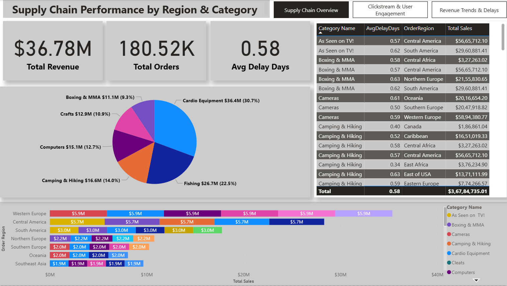
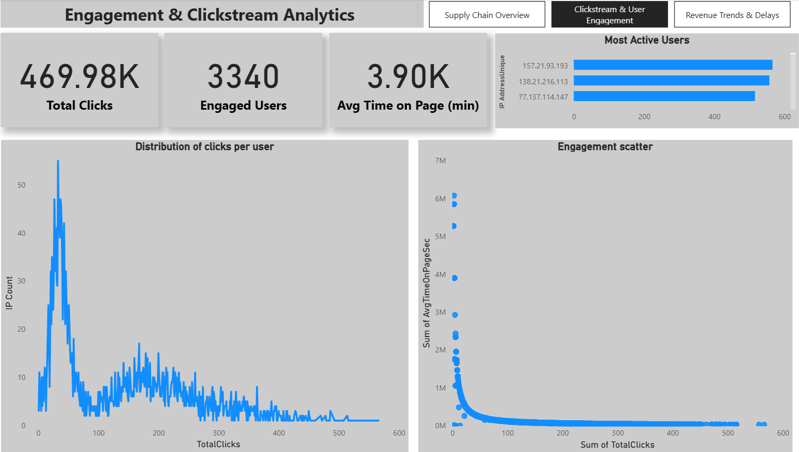
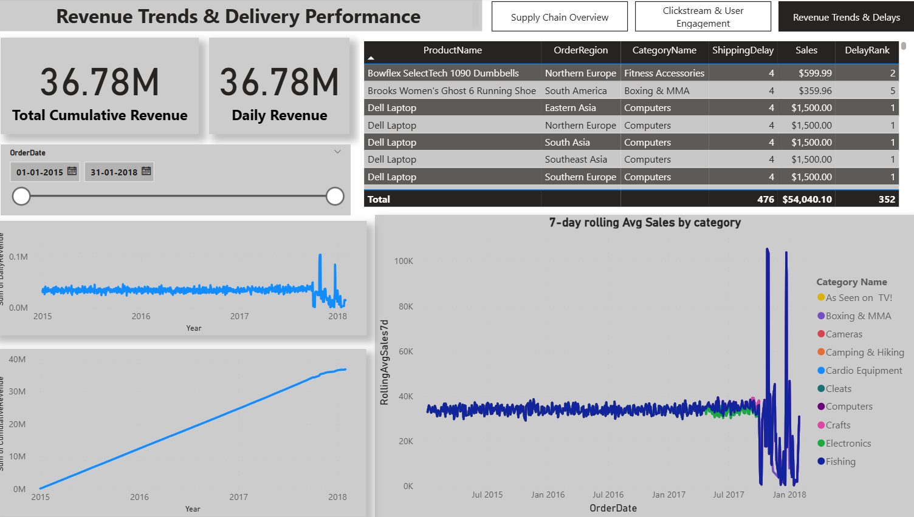

# Supply Chain Analytics using Apache Spark

## Project Overview
This project focuses on building a scalable data processing and analytics pipeline for supply chain data using **Apache Spark** and **PySpark**. The objective is to efficiently ingest, clean, transform, analyze, and optimize large datasets while validating performance through benchmarking and execution plan analysis.

The project is structured week-wise to gradually introduce advanced Spark concepts and best practices.

---

## Tech Stack
- Python 3.9
- Apache Spark (PySpark)
- Java 11
- VS Code
- Jupyter Notebook (`.ipynb`)
- Windows OS

---

## Week 1: Data Ingestion & Performance Benchmarking

### 1. Data Ingestion
- Multiple datasets were ingested using PySpark DataFrame APIs.
- Spark automatically **inferred schemas** using `inferSchema=True`.
- Schemas were **verified** by printing them using `printSchema()`.
- Data correctness was validated using row counts.

**Key Outcome:**
- Large CSV files successfully loaded into Spark DataFrames.
- Schema inference and verification confirmed through execution output.

---

### 2. Performance Benchmarking (Pandas vs Spark)
- Load time of the primary dataset was compared using:
  - Pandas (`read_csv`)
  - PySpark (`spark.read.csv`)
- Execution times and row counts were measured.

**Observation:**
- Pandas performed faster for single-machine loading.
- Spark showed higher overhead but is designed for scalability and distributed workloads.

---

## Week 2: Data Processing, Optimization & Advanced Analytics

### 1. Data Cleaning and Transformation
- Data was cleaned using PySpark DataFrame transformations.
- Invalid or unnecessary records were filtered.
- New derived columns were created for analytical purposes.

**Outcome:**
- Dataset prepared for advanced analytics and aggregations.

---

### 2. Performance-Critical Aggregations
- Heavy aggregations were performed using optimized Spark functions:
  - `groupBy`
  - `avg`
  - `count`
- Metrics such as average delivery delay and late delivery counts were calculated.

**Outcome:**
- Efficient distributed aggregations on large datasets.
- No Python loops were used, ensuring optimal Spark execution.

---

### 3. Spark Window Functions
- Spark Window Functions were implemented to perform advanced analytics without collapsing data.
- Calculated:
  - Running totals
  - Rolling averages
- Used `Window.partitionBy()` and `Window.orderBy()`.

**Outcome:**
- Enabled cumulative and rolling analysis while preserving row-level data.

---

### 4. DAG Analysis & Optimization
- Spark execution plans were reviewed using **Spark UI (DAG Visualization)**.
- Shuffle operations, stages, and task distribution were analyzed.
- Resource utilization and execution flow were validated.

**Outcome:**
- Confirmed minimal shuffles and efficient resource usage.
- Validated Spark’s optimized execution model.

---

### 5. Power BI Dashboard
**DAX Measures for**.
- Supply Chain Measures
- Clickstream Measures
- Rolling & Revenue Measures

**Supply Chain Measures**
```
Total Revenue = SUM(SupplyChainAgg[TotalSales])
```

```
Avg Delay Days = AVERAGE(SupplyChainAgg[AvgDelayDays])
```

```
Total Orders = SUM(SupplyChainAgg[OrderCount])
```

```
Revenue by Region = 
CALCULATE(
    [Total Revenue],
    ALLEXCEPT(SupplyChainAgg, SupplyChainAgg[OrderRegion])
)
```

```
% of Total Revenue = 
DIVIDE([Total Revenue], CALCULATE([Total Revenue], ALL(SupplyChainAgg)), 0)
```

**Clickstream Measures**

```
Total Clicks = SUM(ClickstreamUserAgg[TotalClicks])
```

```
Avg Time on Page (min) = AVERAGE(ClickstreamUserAgg[AvgTimeOnPageSec]) / 60
```

```
Engaged Users = COUNTROWS(ClickstreamUserAgg)
```

**Rolling & Revenue Measures**
```
7d Rolling Avg = AVERAGE(RollingSales7d[RollingAvgSales7d])
```

```
Daily Revenue = SUM(CumulativeRevenue[DailyRevenue])
```

```
Cumulative Revenue = SUM(CumulativeRevenue[CumulativeRevenue])
```

```
Total Cumulative Revenue = 
VAR LastDate = MAX(CumulativeRevenue[OrderDate])
RETURN CALCULATE(SUM(CumulativeRevenue[CumulativeRevenue]), CumulativeRevenue[OrderDate] = LastDate)
```

**Built the 3-Page Story**
- Supply Chain Performance by Region & Category


- User Engagement & Clickstream Analytics


- Revenue Trends & Delays


---

## Documentation
- All steps, commands, and explanations are documented in `supply_chain.ipynb`.
- Code execution is handled via `.py` files using `spark-submit`.
- The notebook serves as a structured project report.

---

## Conclusion
The project demonstrates effective use of Apache Spark for large-scale supply chain analytics, covering ingestion, transformation, optimization, benchmarking, and advanced analytical techniques. The implementation follows industry best practices and ensures scalability, performance, and clarity.

---

## How to Run
Example:
```bash
cd Week 2
spark-submit aggregations.py
